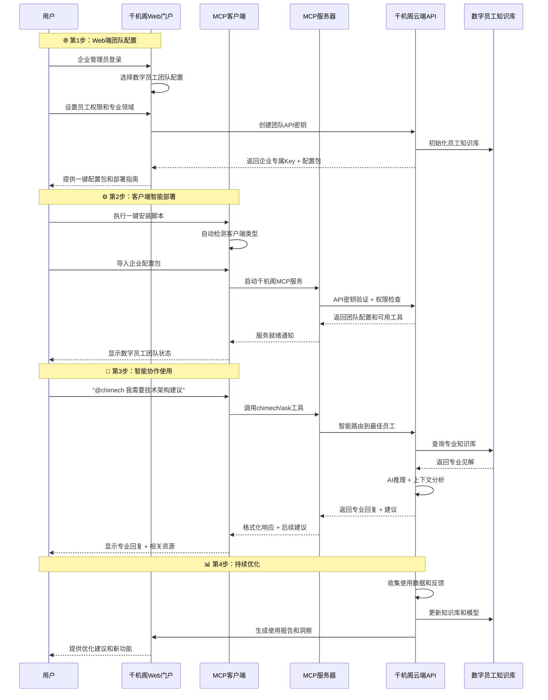

# 千机阁MCP客户端集成指南 - 企业级数字员工平台

## 🎯 概述

千机阁是一个创新的混合架构企业数字员工平台，结合了**Web门户**和**MCP服务器**双重优势。本指南详细介绍如何在主流AI客户端中配置和使用千机阁数字员工服务，让您的专属AI助手团队在任何工作环境中都能发挥作用。

### 🌟 核心特色
- **🔄 混合架构**: Web门户管理 + MCP无缝集成
- **👥 数字员工团队**: 技术专家、业务顾问、创意设计师等多角色
- **🛠️ 全平台支持**: Cursor、Cherry Studio、Claude Desktop、Deepchat
- **🔒 企业级安全**: API密钥管理、权限控制、审计日志
- **📊 智能分析**: 使用统计、性能监控、效果评估

## 🔄 使用流程概览

### 完整使用流程 - 企业级部署



### 🎯 三种部署模式

#### 1. 🚀 快速体验模式
- **适用**: 个人开发者、小团队试用
- **特点**: 5分钟快速配置，立即体验
- **限制**: 基础功能，有使用配额

#### 2. 💼 企业标准模式  
- **适用**: 中小企业、开发团队
- **特点**: 完整功能，团队管理，数据安全
- **优势**: 自定义员工角色，私有部署选项

#### 3. 🏢 企业定制模式
- **适用**: 大型企业、特殊行业
- **特点**: 深度定制，专属部署，SLA保障
- **服务**: 专属顾问，定制开发，7x24支持

## 💻 支持的客户端平台生态

### 🎯 主流客户端全覆盖

| 客户端 | 推荐指数 | 企业适用性 | 配置难度 | 核心优势 |
|--------|----------|------------|----------|----------|
| **Cursor** | ⭐⭐⭐⭐⭐ | 🏢 开发团队首选 | ⭐⭐⭐ | 代码智能、项目集成 |
| **Cherry Studio** | ⭐⭐⭐⭐ | 💼 商务团队理想 | ⭐⭐ | 多模态、工作流 |
| **Claude Desktop** | ⭐⭐⭐⭐ | 📄 通用办公场景 | ⭐⭐ | 稳定性、官方支持 |
| **Deepchat** | ⭐⭐⭐ | 🚀 快速验证 | ⭐ | 轻量级、快速启动 |

### 1. 🔥 Cursor - 开发者专属助手

#### 核心优势
- **🎯 代码智能**: 实时代码分析、智能补全、重构建议
- **🔍 项目理解**: 深度理解项目结构和业务逻辑
- **🛡️ 安全审查**: 自动发现安全漏洞和性能问题
- **📚 技术咨询**: 架构设计、技术选型、最佳实践

#### 适用场景
```typescript
// 代码审查场景
用户: "@chimech 这个函数有什么问题？"
AI技术专家: "发现3个潜在问题：内存泄漏风险、类型安全、性能优化..."

// 架构咨询场景  
用户: "@chimech 如何设计微服务架构？"
AI架构师: "基于您的业务需求，建议采用事件驱动架构..."
```

#### 企业价值
- **⚡ 开发效率**: 提升50%代码质量检查效率
- **🛡️ 安全保障**: 减少80%安全漏洞
- **📈 团队协作**: 统一代码标准和最佳实践

### 2. 🌟 Cherry Studio - 全能工作助手

#### 核心优势
- **🎨 多模态交互**: 文本、图像、文档一体化处理
- **⚡ 工作流自动化**: 自定义业务流程和模板
- **👥 团队协作**: 共享配置、协同工作
- **📊 数据分析**: 智能报表、趋势分析

#### 适用场景
```markdown
# 营销策划场景
用户: "@chimech 制定Q2产品营销方案"
AI营销顾问: 
- 📊 市场分析报告
- 🎯 目标用户画像  
- 📈 推广策略建议
- 💰 预算分配方案

# 商务谈判场景
用户: "@chimech 客户提出价格异议，如何应对？"
AI销售专家: "基于客户背景分析，建议采用价值导向谈判..."
```

#### 企业价值
- **📈 业务增长**: 提升30%营销效果
- **⏱️ 时间节省**: 减少60%重复性工作
- **💡 创新思维**: 激发团队创意和洞察

### 3. 🏛️ Claude Desktop - 稳定可靠之选

#### 核心优势
- **🔒 官方保障**: Anthropic官方支持，稳定性最佳
- **📄 文档处理**: 专业的文档分析和处理能力
- **🌐 通用适配**: 适合各种办公场景
- **🔧 简单配置**: 开箱即用，配置简单

#### 适用场景
```text
# 文档分析场景
用户: "@chimech 分析这份合同的风险点"
AI法务顾问: "发现5个需要关注的条款..."

# 会议纪要场景
用户: "@chimech 整理会议要点和行动项"
AI助理: "会议核心决策3项，待办事项7项..."
```

### 4. ⚡ Deepchat - 轻量快速体验

#### 核心优势
- **🚀 快速启动**: 30秒完成配置
- **💾 资源占用少**: 适合低配置环境
- **🎯 专注对话**: 纯净的对话体验
- **🔧 易于集成**: 支持嵌入式部署

#### 适用场景
- 快速原型验证
- 移动端轻量使用
- 嵌入式应用集成
- 新用户体验入门

## 🛠️ 智能配置指南 - 一键部署

### 🚀 快速开始 - 30秒配置

#### 方式1：一键配置脚本（推荐）

```bash
# 下载并运行智能配置脚本
curl -fsSL https://setup.chimech.com/install.sh | bash

# 或使用PowerShell (Windows)
iwr -useb https://setup.chimech.com/install.ps1 | iex
```

脚本会自动：
- ✅ 检测您的操作系统和客户端
- ✅ 安装千机阁MCP服务器
- ✅ 生成配置文件
- ✅ 测试连接状态

#### 方式2：手动配置

```bash
# 1. 安装千机阁MCP服务器
npm install -g @chimech/mcp-server

# 2. 验证安装
chimech-mcp --version

# 3. 初始化配置
chimech-mcp init --interactive
```

### 1. 🔥 Cursor 智能配置

#### 自动配置（推荐）

```bash
# 使用千机阁配置助手
chimech-mcp setup cursor --api-key YOUR_API_KEY

# 输出示例：
# ✅ 检测到 Cursor 编辑器
# ✅ 自动生成配置文件
# ✅ 配置已写入 ~/.cursor/settings.json
# ✅ MCP服务器连接测试成功
# 🎉 配置完成！重启 Cursor 即可使用
```

#### 手动配置

**配置文件位置**:
- **macOS**: `~/Library/Application Support/Cursor/User/settings.json`
- **Windows**: `%APPDATA%\Cursor\User\settings.json`
- **Linux**: `~/.config/Cursor/User/settings.json`

**配置内容**:
```json
{
  "mcpServers": {
    "chimech": {
      "command": "chimech-mcp",
      "args": ["serve"],
      "env": {
        "CHIMECH_API_KEY": "your-enterprise-api-key",
        "CHIMECH_SERVER_URL": "https://api.chimech.com",
        "CHIMECH_WORKSPACE": "enterprise",
        "CHIMECH_LOG_LEVEL": "info"
      }
    }
  }
}
```

#### 高级配置选项

```json
{
  "mcpServers": {
    "chimech": {
      "command": "chimech-mcp",
      "args": ["serve", "--config", "./chimech-config.yml"],
      "env": {
        "CHIMECH_API_KEY": "your-api-key",
        "CHIMECH_SERVER_URL": "https://api.chimech.com",
        
        // 性能优化
        "CHIMECH_CACHE_ENABLED": "true",
        "CHIMECH_CACHE_TTL": "300",
        "CHIMECH_PARALLEL_REQUESTS": "3",
        
        // 安全设置
        "CHIMECH_TLS_VERIFY": "true",
        "CHIMECH_REQUEST_TIMEOUT": "30000",
        
        // 调试模式
        "CHIMECH_DEBUG": "false",
        "CHIMECH_LOG_FILE": "./logs/chimech.log"
      }
    }
  }
}
```

#### 验证配置

```bash
# 测试千机阁MCP服务器连接
chimech-mcp test --client cursor

# 输出示例：
# 🔍 检测 Cursor 配置...
# ✅ 配置文件存在
# ✅ API密钥有效
# ✅ 服务器连接正常
# ✅ 数字员工团队就绪
# 🎉 一切正常！可以开始使用了
```

#### 使用示例

```typescript
// 在Cursor中使用千机阁数字员工
// 场景1：代码安全审查
用户: "@chimech 帮我审查这段代码的安全性"

function processUserData(userData) {
    // 直接使用用户输入，存在安全风险
    const query = `SELECT * FROM users WHERE id = ${userData.id}`;
    return database.query(query);
}

// 千机阁AI安全专家回复：
// 🛡️ 【AI安全专家-张工】发现严重安全问题：
// 
// ❌ 问题分析：
// 1. SQL注入漏洞 - 直接拼接用户输入
// 2. 缺少输入验证和类型检查
// 3. 没有错误处理机制
// 
// ✅ 修复建议：
// ```typescript
// function processUserData(userData: UserData): Promise<QueryResult> {
//   // 1. 输入验证
//   if (!userData?.id || typeof userData.id !== 'number') {
//     throw new ValidationError('Invalid user ID');
//   }
//   
//   // 2. 参数化查询
//   const query = 'SELECT * FROM users WHERE id = ?';
//   return database.query(query, [userData.id]);
// }
// ```
// 
// 📚 相关资源：
// - [OWASP SQL注入防护指南]
// - [TypeScript类型安全最佳实践]

// 场景2：架构设计咨询
用户: "@chimech 如何设计一个高可用的微服务架构？"

// AI架构师回复：
// 🏗️ 【AI架构师-李工】微服务架构设计方案：
// 
// 📋 核心组件：
// 1. API Gateway - 统一入口，负载均衡
// 2. Service Registry - 服务发现和注册
// 3. Config Center - 配置管理中心
// 4. Circuit Breaker - 熔断器模式
// 
// 🔄 推荐技术栈：
// - Gateway: Kong/Envoy
// - Registry: Consul/Eureka  
// - Monitoring: Prometheus + Grafana
// - Tracing: Jaeger/Zipkin
// 
// 需要我详细设计某个组件吗？
```

### 2. 🌟 Cherry Studio 智能配置

#### 自动配置

```bash
# 一键配置Cherry Studio
chimech-mcp setup cherry-studio --api-key YOUR_API_KEY

# 配置选项
chimech-mcp setup cherry-studio \
  --api-key YOUR_API_KEY \
  --workspace enterprise \
  --enable-analytics \
  --custom-prompts
```

#### 手动配置

**配置文件位置**: Cherry Studio设置 → MCP服务器 → 添加服务器

```json
{
  "name": "千机阁企业数字员工",
  "description": "专属AI助手团队 - 技术/商务/创意全覆盖",
  "executable": {
    "command": "chimech-mcp",
    "args": ["serve", "--mode", "cherry-studio"],
    "env": {
      "CHIMECH_API_KEY": "your-enterprise-api-key",
      "CHIMECH_WORKSPACE": "enterprise",
      "CHIMECH_ENABLE_MULTIMODAL": "true",
      "CHIMECH_CUSTOM_TEMPLATES": "true"
    }
  },
  "capabilities": [
    "text-generation",
    "code-analysis", 
    "document-processing",
    "image-analysis",
    "workflow-automation"
  ]
}
```

#### 验证和使用

```bash
# 验证Cherry Studio配置
chimech-mcp test --client cherry-studio

# 使用示例场景
```

**营销策划场景**:
```markdown
用户: "@chimech 我需要制定Q2新产品营销策略"

🎯 【AI营销顾问-小李】为您制定全方位营销策略：

## 📊 市场洞察分析
### 目标用户画像
- 核心用户：25-40岁职场人士
- 痛点：效率提升、成本控制
- 消费习惯：注重品质和性价比

### 竞品分析矩阵
| 竞品 | 优势 | 劣势 | 机会点 |
|------|------|------|--------|
| 产品A | 品牌知名度高 | 价格偏高 | 性价比优势 |
| 产品B | 功能丰富 | 操作复杂 | 易用性差异化 |

## 🎯 策略制定
### 1. 产品定位
- **核心价值**：高效、易用、经济
- **差异化优势**：AI驱动的智能化体验

### 2. 推广策略
- **第一阶段**：KOL种草 + 社交媒体预热
- **第二阶段**：产品发布会 + 媒体矩阵
- **第三阶段**：用户增长 + 口碑营销

### 3. 预算分配建议
- 数字营销：40% (¥200万)
- 传统媒体：30% (¥150万)  
- 活动推广：20% (¥100万)
- 内容制作：10% (¥50万)

需要我详细展开某个部分吗？
```

### 3. 🏛️ Claude Desktop 企业配置

#### 自动配置

```bash
# 配置Claude Desktop
chimech-mcp setup claude-desktop --api-key YOUR_API_KEY

# 企业级配置
chimech-mcp setup claude-desktop \
  --api-key YOUR_API_KEY \
  --enable-document-analysis \
  --enable-workflow-automation
```

#### 配置文件位置

- **macOS**: `~/Library/Application Support/Claude/claude_desktop_config.json`
- **Windows**: `%APPDATA%\Claude\claude_desktop_config.json`
- **Linux**: `~/.config/Claude/claude_desktop_config.json`

#### 企业级配置

```json
{
  "mcpServers": {
    "chimech": {
      "command": "chimech-mcp",
      "args": ["serve", "--mode", "claude-desktop"],
      "env": {
        "CHIMECH_API_KEY": "your-enterprise-api-key",
        "CHIMECH_WORKSPACE": "enterprise",
        "CHIMECH_ENABLE_DOCUMENT_AI": "true",
        "CHIMECH_ENABLE_WORKFLOW": "true",
        "CHIMECH_SECURITY_LEVEL": "high"
      }
    }
  },
  "globalShortcuts": {
    "chimech.quickAsk": "Ctrl+Shift+C"
  }
}
```

### 4. ⚡ Deepchat 轻量配置

#### 快速部署

```bash
# 一键配置Deepchat
chimech-mcp setup deepchat --api-key YOUR_API_KEY --lightweight

# 嵌入式部署
chimech-mcp setup deepchat \
  --api-key YOUR_API_KEY \
  --embedded \
  --port 3000
```

#### 配置选项

```json
{
  "mcp": {
    "servers": {
      "chimech": {
        "command": "chimech-mcp",
        "args": ["serve", "--lightweight"],
        "env": {
          "CHIMECH_API_KEY": "your-api-key",
          "CHIMECH_MODE": "lightweight",
          "CHIMECH_CACHE_DISABLED": "true",
          "CHIMECH_RESPONSE_FORMAT": "simple"
        }
      }
    }
  },
  "ui": {
    "theme": "minimal",
    "showBranding": false
  }
}
```

#### 环境变量配置

```bash
# 环境变量方式（适合容器部署）
export CHIMECH_API_KEY="your-api-key"
export CHIMECH_MODE="lightweight"

# 启动Deepchat
deepchat --mcp-server chimech --port 8080
```

## 🔧 高级配置选项

### 环境变量配置

```bash
# 必需配置
CHIMECH_API_KEY="your-api-key"           # 从Web门户获取的API Key
CHIMECH_SERVER_URL="https://api.chimech.com"  # 千机阁API服务器地址

# 可选配置
CHIMECH_TIMEOUT=30000                    # 请求超时时间（毫秒）
CHIMECH_RETRY_COUNT=3                    # 重试次数
CHIMECH_LOG_LEVEL="info"                 # 日志级别：debug, info, warn, error
CHIMECH_CACHE_TTL=300                    # 缓存时间（秒）
```

### 代理配置

```json
{
  "mcpServers": {
    "chimech": {
      "command": "npx",
      "args": ["@chimech/mcp-server"],
      "env": {
        "CHIMECH_API_KEY": "your-api-key",
        "HTTP_PROXY": "http://proxy.company.com:8080",
        "HTTPS_PROXY": "http://proxy.company.com:8080"
      }
    }
  }
}
```

### 自定义配置文件

```yaml
# chimech-config.yml
server:
  url: "https://api.chimech.com"
  timeout: 30000
  retries: 3

auth:
  api_key: "${CHIMECH_API_KEY}"

logging:
  level: "info"
  file: "./chimech.log"

cache:
  enabled: true
  ttl: 300
```

## 🎯 使用场景和示例

### 1. 代码开发场景（Cursor）

```typescript
// 场景：代码审查
用户: @chimech 请审查这个React组件的性能问题

const UserList = ({ users }) => {
  return (
    <div>
      {users.map(user => (
        <div key={user.id}>
          
          <span>{user.name}</span>
          <span>{user.email}</span>
        </div>
      ))}
    </div>
  );
};

// AI技术专家回复：
// 【AI技术专家-张工】发现几个性能优化点：
// 1. 缺少React.memo优化
// 2. 图片未做懒加载
// 3. 建议使用虚拟滚动
// [提供优化后的代码...]
```

### 2. 商务咨询场景（Cherry Studio）

```
用户: @chimech 客户提出了价格异议，如何应对？

AI销售顾问回复:
【AI销售顾问-小王】价格异议处理策略：

🎯 异议分析
- 真实异议 vs 假性异议
- 价格敏感度评估
- 竞品价格对比

💬 应对话术
1. "我理解您的考虑，让我为您分析一下价值..."
2. "相比竞品，我们的优势在于..."
3. "我们可以探讨一些灵活的合作方式..."

📋 后续动作
- 准备价值证明材料
- 安排产品演示
- 制定优惠方案

需要我提供具体的话术模板吗？
```

### 3. 学习辅导场景（Claude Desktop）

```
用户: @chimech 请解释一下什么是微服务架构

AI技术导师回复:
【AI技术导师-李老师】微服务架构详解：

🏗️ 基本概念
微服务是将单一应用程序拆分为多个小型、独立服务的架构模式。

📊 核心特征
1. 服务独立部署
2. 数据库分离
3. 通过API通信
4. 故障隔离

⚖️ 优缺点对比
优点：可扩展性强、技术栈灵活
缺点：复杂度增加、运维成本高

🛠️ 实施建议
1. 从单体应用开始
2. 逐步拆分服务
3. 建立DevOps体系

需要我画个架构图帮您理解吗？
```

## 🔍 故障排除

### 常见问题及解决方案

#### 1. 连接失败

**问题**: MCP服务器无法连接
```
错误: Failed to connect to ChiMech MCP server
```

**解决方案**:
```bash
# 检查网络连接
curl -I https://api.chimech.com/health

# 验证API Key
npx @chimech/mcp-server --verify-key your-api-key

# 检查防火墙设置
```

#### 2. API Key无效

**问题**: API Key验证失败
```
错误: Invalid API key provided
```

**解决方案**:
1. 检查Key是否正确复制
2. 确认Key未过期
3. 在Web门户重新生成Key

#### 3. 超时问题

**问题**: 请求超时
```
错误: Request timeout after 30000ms
```

**解决方案**:
```bash
# 增加超时时间
export CHIMECH_TIMEOUT=60000

# 或在配置中设置
{
  "env": {
    "CHIMECH_TIMEOUT": "60000"
  }
}
```

### 调试模式

```bash
# 启用调试日志
export CHIMECH_LOG_LEVEL=debug

# 查看详细日志
npx @chimech/mcp-server --debug
```

### 健康检查

```bash
# 检查服务状态
npx @chimech/mcp-server --health-check

# 输出示例：
# ✅ MCP服务器运行正常
# ✅ API连接正常
# ✅ 数字员工响应正常
# 📊 平均响应时间: 1.2s
```

## 📊 使用统计和监控

### 查看使用情况

```bash
# 查看本月使用统计
npx @chimech/mcp-server --stats monthly

# 输出示例：
# 📈 千机阁使用统计 (2025年1月)
# 总调用次数: 1,234
# 成功率: 98.5%
# 平均响应时间: 1.8s
# 最常用功能: 代码审查 (45%)
```

### Web门户监控

用户可以在千机阁Web门户的"使用统计"页面查看：
- 📊 调用次数趋势图
- ⏱️ 响应时间分析
- 🎯 功能使用分布
- 📱 客户端使用情况

## 🚀 最佳实践

### 1. API Key管理
- **定期轮换**: 建议每3个月更换一次API Key
- **环境隔离**: 开发、测试、生产环境使用不同Key
- **权限最小化**: 为不同用途创建专门的Key

### 2. 使用优化
- **明确指令**: 提供具体、明确的问题描述
- **上下文信息**: 提供相关背景信息
- **分步骤询问**: 复杂问题分解为多个小问题

### 3. 安全建议
- **Key保密**: 不要在代码中硬编码API Key
- **网络安全**: 在企业网络中使用时注意防火墙配置
- **日志安全**: 避免在日志中记录敏感信息

## 📚 进阶功能

### 自定义工具扩展

```typescript
// 扩展千机阁MCP工具
import { ChiMechMCPServer } from '@chimech/mcp-server';

const server = new ChiMechMCPServer({
  apiKey: process.env.CHIMECH_API_KEY,
  customTools: [
    {
      name: 'chimech/code-review',
      description: '专业代码审查工具',
      handler: async (params) => {
        // 自定义处理逻辑
        return await server.callEmployee('tech-expert', params);
      }
    }
  ]
});
```

### 批量操作

```bash
# 批量配置多个客户端
chimech-cli batch-setup \
  --clients cursor,cherry-studio,claude \
  --api-key your-key \
  --config-template enterprise
```

---

*千机阁MCP客户端集成指南 v1.0*  
*最后更新：2025年1月* 